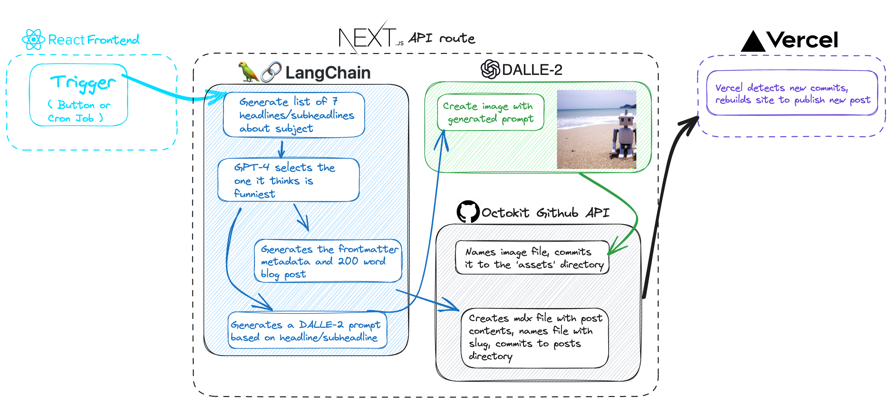

# Satirical Silicon: The Absurdist Odyssey of AI-Generated Tech News 🤖💻

Ahoy, code wrangler! You've stumbled onto the grand spectacle of Satirical Silicon - a beacon of chaos in the orderly world of tech. It's a place where programming, parody, and an AI with a sense of humor rivalling that of a dial-up modem mingle to birth perfect(ly preposterous) prose.

## What is this madness, you ask? 🤔

Satirical Silicon is an open-source project that uses cutting-edge artificial intelligence to automatically post a blog every day. And not just any blog, but a satirical take on tech news. Imagine your tech feed after a weekend bender in Vegas, and you're halfway there.

## Tech Stack 🏭

This unholy matrimony of tech nonsense wouldn't be possible without a stack that sounds like a hipster's grocery list:

- React: Because who doesn't love spending hours on end debugging?
- Next.js: When you want to go serverless, but still want to feel like you're doing something important.
- MDX: Because Markdown was too easy.
- Langchain: A tool for creating AI chains. Or is it a chain for creating AI tools? Who knows.
- Tailwind CSS: A utility-first CSS framework for rapidly building custom designs. Or rapidly tearing out your hair. Depends on the day.

## How Does it Work? 🤔

## How Do You Use It? 🤷‍♀️

It's as easy as falling off a log! Actually, that sounds painful. Let's say it's as easy as eating pie. Unless you're on a diet. Nevermind, here are the steps:

1. Fork this repository, because who doesn't like some good old fashioned cutlery.
2. Clone it to your local machine. Or quantum computer. We're not here to judge.
3. Install the dependencies using `npm install`. This might be a good time to make a cup of coffee.
4. Run the project using `npm run dev`.
5. Delete the posts in the posts directory and add your own, if you want. Or just steal mine, that's cool too.
6. Enjoy the satirical posts! Or, you know, weep for the future of humanity. Again, no judgement.

## Contributing: Because Misery Loves Company 👫

Fancy adding your own two bytes to this masterpiece? Go ahead, fork this repository, add your magic (or tragic - we appreciate both), and then submit a pull request. We promise to review it as soon as we've deciphered the latest AI-generated post.

## Disclaimer ⚠️

We're not responsible for any laughter, tears, or existential crises that may result from using this project.

Happy coding, or whatever it is you people do!

